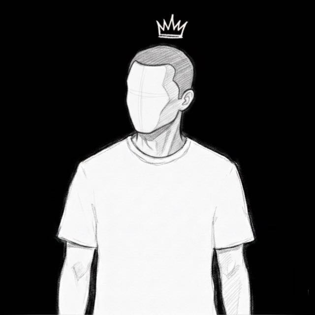

# 🌐 Bruninh Profile

Uma página de perfil pessoal moderna no estilo **Link in Bio**, desenvolvida com **HTML, CSS e JavaScript puro**, combinando estética cyberpunk, efeitos animados e diversas interações.

🔗 **[Ver página ao vivo](https://bruno15987.github.io/bruninh/)**

---

## ✨ Sobre o projeto

O **Bruninh Profile** é uma página de perfil responsiva criada para reunir informações pessoais e redes sociais em uma única interface.

O projeto utiliza animações, efeitos visuais, música de fundo, contador de visualizações e suporte a tema claro/escuro para criar uma experiência mais dinâmica e personalizada.

---

## 🚀 Funcionalidades

* 🟢 Status online no perfil
* 🟩 Efeito **Matrix** animado no fundo
* ⭐ Fundo com estrelas animadas
* 🪟 Card com efeito **Glassmorphism**
* 🌫️ Textura de grain no card
* ✨ Animação de entrada do perfil
* ⌨️ Efeito de digitação no nome e na frase
* 👋 Saudação automática:

  * Bom dia
  * Boa tarde
  * Boa noite
* 🕐 Relógio em tempo real
* 👁️ Contador de visualizações
* 💾 Controle de visualização por dispositivo usando `localStorage`
* 🎵 Música de fundo
* 🔊 Controle de volume com slider
* 📱 Controle de volume compatível com dispositivos móveis
* 🌙 Tema escuro
* ☀️ Tema claro
* 🖱️ Cursor personalizado
* 🖱️ Efeitos ao passar o mouse
* 💬 Tooltips nas redes sociais
* 👾 Efeito glitch no nome
* 🔊 Sons de interação
* 🥚 Easter egg secreto
* 📱 Layout responsivo

---

## 🛠️ Tecnologias utilizadas

* **HTML5**
* **CSS3**
* **JavaScript**
* **Canvas API**
* **Font Awesome**
* **Google Fonts**
* **CountAPI**
* **GitHub Pages**

O projeto não utiliza frameworks ou bibliotecas JavaScript para sua lógica principal.

---

## 📂 Estrutura do projeto

```text
📦 bruninh
┣ 📜 index.html
┣ 🖼️ favicon.jpeg
┣ 🎵 sua-musica.mp3
┗ 📜 README.md
```

### Arquivos

| Arquivo          | Função                                    |
| ---------------- | ----------------------------------------- |
| `index.html`     | Estrutura, estilos e JavaScript da página |
| `favicon.jpeg`   | Foto de perfil                            |
| `sua-musica.mp3` | Música de fundo                           |
| `README.md`      | Documentação do projeto                   |

---

## 🎨 Personalização

### 👤 Foto de perfil

Substitua:

```text
favicon.jpeg
```

pela sua própria imagem.

O código atualmente utiliza:

```html

```

---

### ✏️ Nome e frase

O nome e a frase são definidos no JavaScript através do efeito de digitação:

```javascript
await typeText(nameEl, 'Bruninh', 100);
```

e:

```javascript
await typeText(quoteEl, 'Sua frase aqui', 30);
```

Altere esses valores para personalizar o perfil.

---

### 🔗 Redes sociais

Os links das redes sociais ficam dentro de:

```html
<div class="social-icons">
```

Atualmente o projeto possui links para:

* GitHub
* YouTube
* Instagram

Basta substituir as URLs pelos seus próprios perfis.

---

### 🎵 Música

A música é carregada através de:

```html
<audio id="bg-music" loop>
    <source src="sua-musica.mp3" type="audio/mpeg">
</audio>
```

Coloque seu arquivo `.mp3` na mesma pasta do `index.html`.

Depois, altere `sua-musica.mp3` caso utilize outro nome.

---

## 👁️ Contador de visualizações

O projeto possui um contador de visualizações utilizando a **CountAPI**.

O sistema utiliza duas chaves:

```javascript
const counterKey = 'bruno15987-bruninh-v3';
const storageKey = 'bruninh_visited_v3';
```

O `localStorage` é utilizado para evitar que o mesmo dispositivo incremente o contador novamente.

Se o visitante já tiver sido registrado, o código apenas consulta o valor atual. Caso contrário, registra uma nova visualização.

### 🔑 Alterando a chave

Para utilizar o contador em outro projeto, altere:

```javascript
const counterKey = 'seu-projeto-v1';
const storageKey = 'seu_projeto_visited_v1';
```

É recomendável utilizar nomes exclusivos para evitar compartilhar o mesmo contador com outro projeto.

---

## 🌙 Tema claro e escuro

A página possui dois temas:

* 🌑 Escuro
* ☀️ Claro

O botão de tema alterna a classe:

```javascript
document.body.classList.toggle('light');
```

As cores são controladas principalmente através das variáveis CSS dentro de `:root`.

Exemplo:

```css
:root {
    --bg: #000000;
    --text: #ffffff;
    --accent: #79C83D;
}
```

Para personalizar as cores, altere essas variáveis.

---

## 🟩 Efeito Matrix

O fundo utiliza a **Canvas API** para criar uma animação inspirada no efeito Matrix.

Os caracteres utilizados incluem:

* Números
* Letras
* Katakana
* Símbolos

O efeito é renderizado continuamente através de JavaScript.

---

## 🎵 Sistema de música

A página possui controles independentes para:

* ▶️ Reproduzir
* ⏸️ Pausar
* 🔊 Aumentar/diminuir volume
* 🔇 Silenciar

O volume é controlado através de:

```javascript
music.volume = volumeSlider.value;
```

O ícone também muda automaticamente de acordo com o nível de volume.

> ⚠️ Alguns navegadores podem bloquear a reprodução automática de áudio. Por isso, a música é iniciada através da interação do usuário.

---

## 🥚 Easter Egg

Existe um pequeno segredo escondido na página.

Para descobrir:

**Clique 5 vezes no nome "Bruninh".**

O projeto exibirá uma mensagem indicando que o Easter Egg foi encontrado.

---

## 📱 Responsividade

A interface foi desenvolvida para funcionar em diferentes tamanhos de tela, incluindo:

* 💻 Computadores
* 📱 Celulares
* 📲 Tablets

O controle de volume também foi desenvolvido pensando em dispositivos móveis.

---

## 🚀 Como executar localmente

Clone o repositório:

```bash
git clone https://github.com/Bruno15987/bruninh.git
```

Entre na pasta:

```bash
cd bruninh
```

Depois, abra:

```text
index.html
```

em seu navegador.

Não é necessário instalar Node.js, Python ou qualquer dependência para executar a página básica.

---

## 🌐 Publicando no GitHub Pages

1. Crie um repositório no GitHub.
2. Envie os arquivos do projeto.
3. Abra **Settings**.
4. Acesse **Pages**.
5. Em **Source**, selecione a branch `main`.
6. Salve as configurações.
7. Aguarde o GitHub Pages publicar o projeto.

Depois disso, sua página poderá ser acessada através do endereço:

```text
https://SEU-USUARIO.github.io/SEU-REPOSITORIO/
```

---

## 🧰 Git

### Primeiro envio

```bash
git init
git add .
git commit -m "Primeira versão do meu perfil"
git branch -M main
git remote add origin https://github.com/SEU-USUARIO/SEU-REPOSITORIO.git
git push -u origin main
```

### Atualizando o projeto

Depois de realizar alterações:

```bash
git add .
git commit -m "Atualiza perfil"
git push
```

Se o repositório remoto tiver alterações que ainda não estão no computador:

```bash
git pull --rebase origin main
git push
```

---

## 📸 Preview

Você pode adicionar uma imagem ou GIF do projeto aqui:

```markdown

```

Basta colocar `preview.png` na raiz do projeto.

---

## 🔮 Possíveis melhorias futuras

Algumas ideias para futuras versões:

* [ ] Persistência do tema escolhido
* [ ] Mais redes sociais
* [ ] Animações adicionais
* [ ] Página de projetos
* [ ] Links personalizados
* [ ] Estatísticas do GitHub
* [ ] Sistema de links externos
* [ ] Melhorias de acessibilidade
* [ ] Otimização de performance

---

## 📄 Licença

Este projeto está disponível para **uso pessoal e educacional**.

Você pode modificar e adaptar o código para seus próprios projetos.

---

## ❤️ Créditos

Desenvolvido por **Bruninh**.

Projeto criado com **HTML, CSS e JavaScript**, inspirado no conceito de páginas **Link in Bio** com estética cyberpunk.

---

⭐ Se você gostou do projeto, considere deixar uma estrela no repositório!
